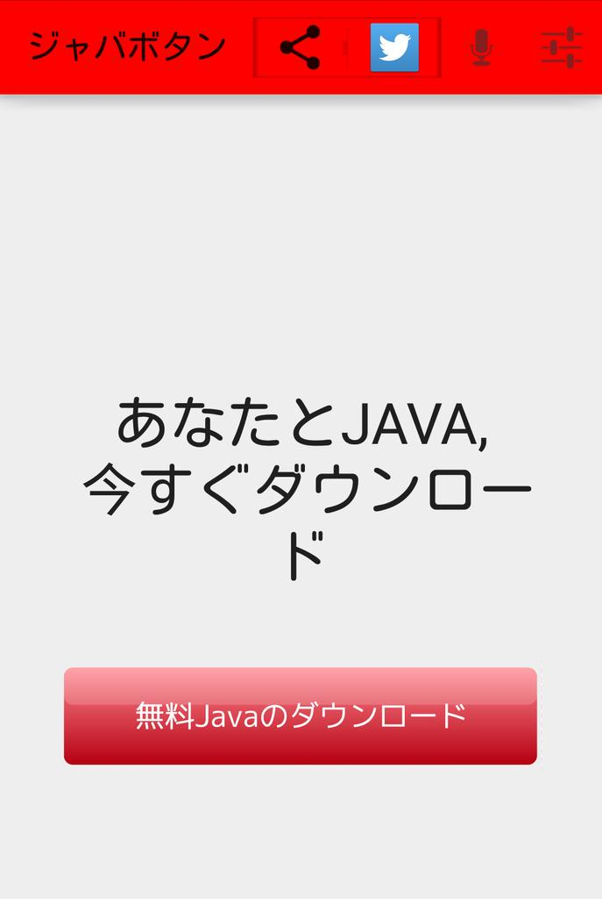

# ドットインストールにない git の使い方

by [@toby_net](https://twitter.com/toby_net)

---

# スポンサー

---

宣伝： ジャバボタン」

ダウンロード今すぐ ⇒
<http://www.amazon.co.jp/dp/B00FZID6BW>

  

> 「無料Javaのダウンロード」と書かれたボタンを押すと、端末が「ジャバ」と音声でしゃべる 

---

# コマンド編

1. `git add -p`
2. `git blame`
3. `git bisect`
4. `git clone --depth 1 $URL`

---

# FAQ

0. 事例
1. お手軽につかうには？
2. ブランチの扱い
3. SVN との checkout の違い

---

# 参考サイト

* [ドットインストール git入門 (全22回)](http://dotinstall.com/lessons/basic_git)
* まずはこれ ⇒ [Pro git](http://git-scm.com/book/en/v2)
* コマンドラインで使った後にみるととてもよい ⇒ [入門Git](http://www.amazon.co.jp/dp/4798023809/)

---

# ご覧のスポンサー

でお送りいたしました

* [ジャバ組](https://github.com/arigato-java/JavaButton)

* リレー小説かいてます ⇒  [Relayr](http://relayr.herokuapp.com/)
* 有志によるジャバ小説まとめ ⇒  [ジャバ名作劇場](http://arigato-java.esy.es/shosetsu.html)

